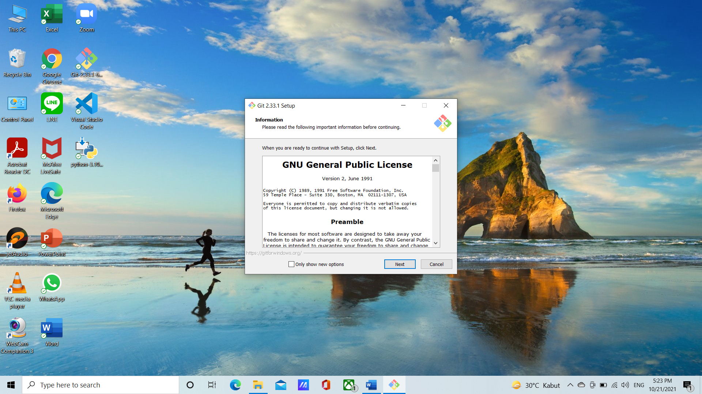
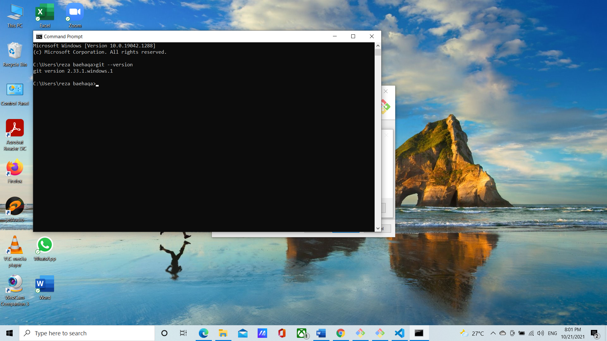
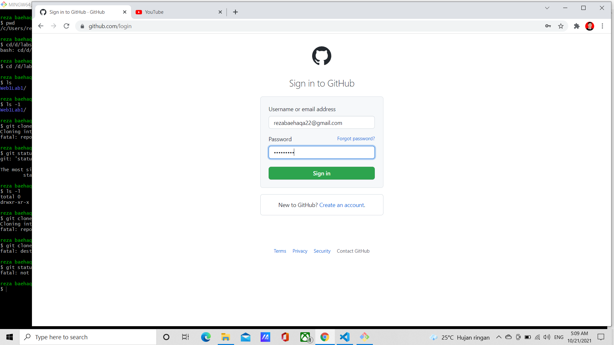
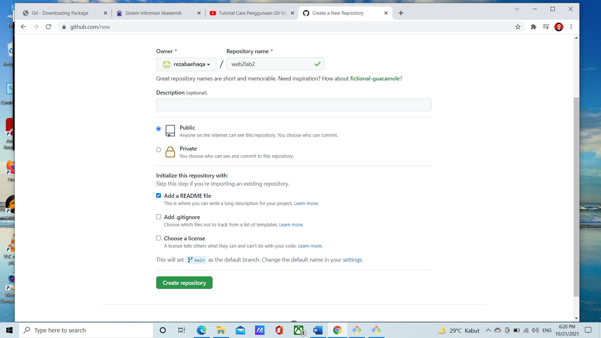
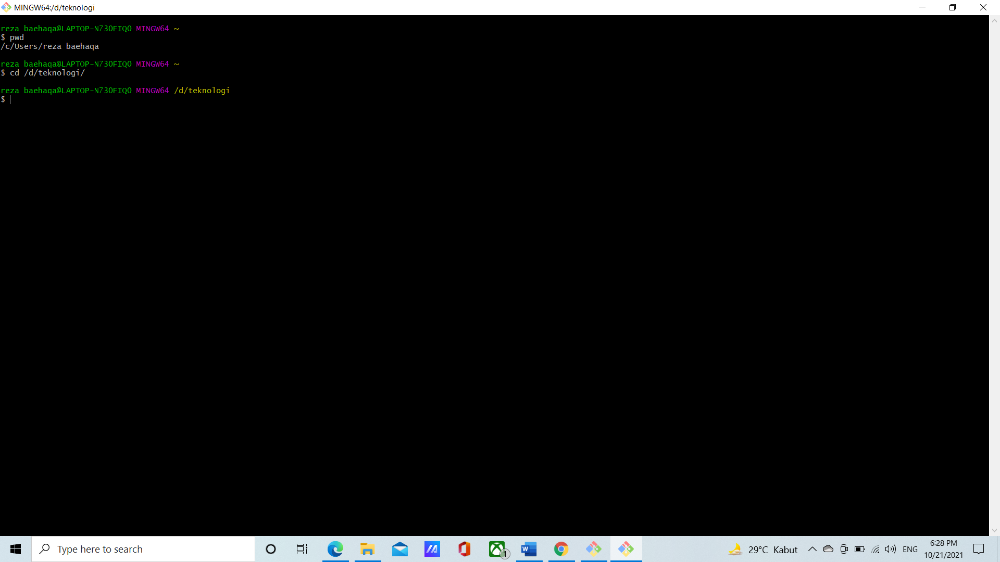
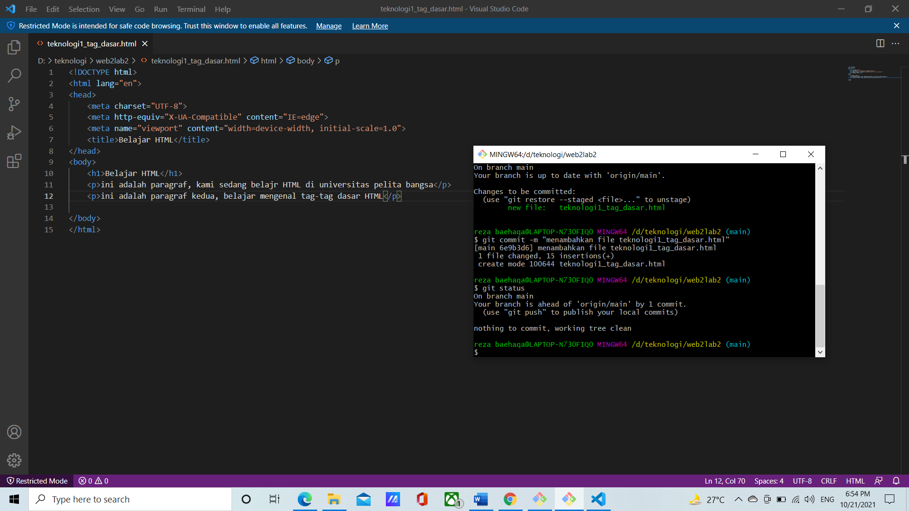
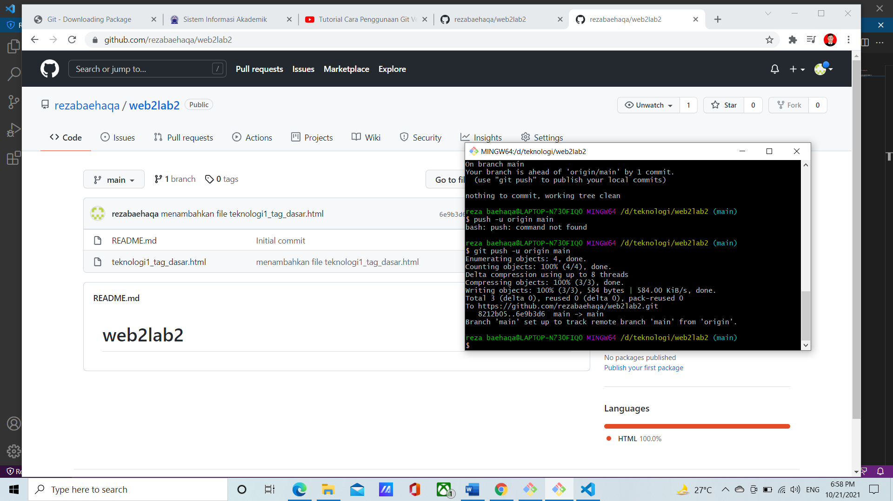
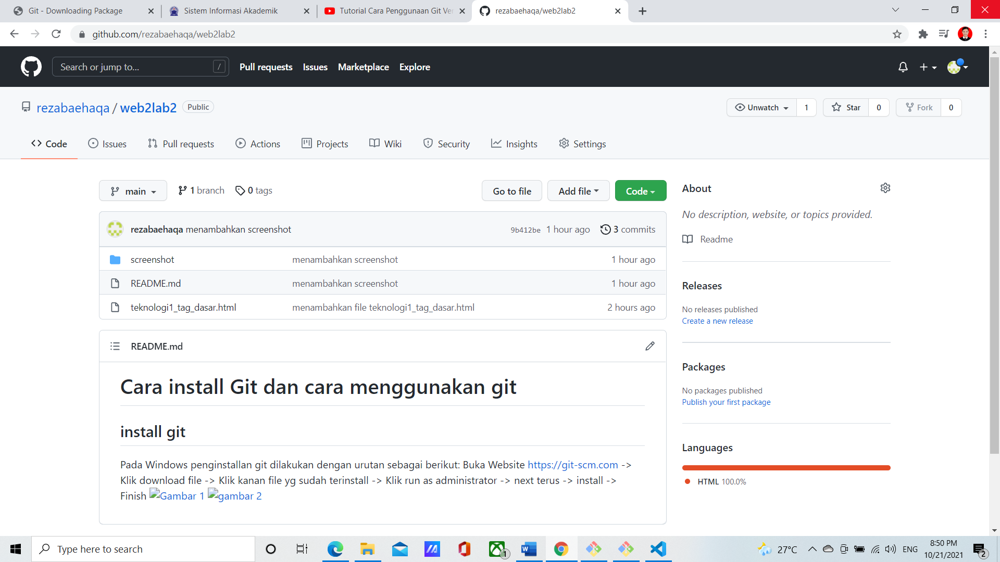

# Cara install Git dan cara menggunakan git
## install git

Pada Windows penginstallan git dilakukan dengan urutan sebagai berikut: 

Buka Website https://git-scm.com -> Klik download file -> Klik kanan file yg sudah terinstall -> Klik run as administrator -> next terus -> install -> Finish

Selamat git sudah terinstall di perangkat anda, untuk mencobanya silahkan buka cmd untuk mengeceknya apa sudah terinstal atau belom dengan mengetik :

git --version

### cara penggunaan git 
setelah berhasil instal ke git selanjutnya
### login Git
Untuk login ke Git, kita bisa menggunakan akun GitHub. Jika belum memiliki akun kita bisa mendaftarkan diri terlebih dahulu. Selanjutnya kita bisa melakukan login awal pada Git menggunakan Terminal desktop anda . Kemudian masukkan perintah-perintahnya ini dilakukan sekali saja pada saat komputer anda baru terinstall git

lalu masukkan username & email Git menggunakan perintah di bawah ini. Lalu tekan ENTER jika sudah benar.

git config --global user.name "rezabaehaqa"
git config --global user.email rezabaehaqa22@gmail.com
### login di github.com
Disini kita memasukan email dan dan password kita selanjutnya kalian klik login, akan muncul tampilan dashboard dari GitHub seperti gambar di bawah ini.

### buat repository
Setelah berhasil login ke GitHub, Anda bisa mulai membuat repository. Klik tombol "Create Repository" pada menu Repositories untuk membuat repository baru. 

Kita perlu mengisi informasi sebagai berikut

• Nama Repository : digunakan untuk identitas repository yang dibuat.

• Deskripsi Repository : berfungsi untuk deskripsi dari repository yang dibuat.

• Jenis Repository : jenis repository dibagi menjadi Public dan Private

### Buat folder pada dekstop
Selanjutnya, kalian perlu membuat folder pada local disk komputer kalian. Fungsinya adalah untuk menyimpan update file dari repository GitHub yang telah kalian buat. dengan perintah berikut

Buka Finder -> Klik Dekstop -> Klik logo setting -> Klik Folder Baru -> Beri nama folder -> Selesai
### ubah folder menjadi repository
Setelah itu, ubah folder tersebut menjadi repository menggunakan perintah berikut:

### Tambahkan file repository
Untuk bisa menambahkan file ke repository GitHub,perlu menerapkan langkah-langkah di bawah ini:

Buat file di folder yang sudah dibuat (teknologi-Git). Contohnya, di sini membuat file  tag htmlt : index.html  

Buka GitBash lalu masukkan perintah berikut:
Git add html
### Buat commit
Selanjutnya, perlu membuat Commit. Commit berfungsi untuk menambahkan update file serta komentar. Jadi setiap kontributor bisa memberikan konfirmasi update file di proyek yang sedang dikerjakan. Masukkan perintah berikut untuk membuat Commit:

git commit -m "first commit"

### remote repository
Remote repository berfungsi untuk mengupload file yang telah kita buat sebelumnya di local disk. Masukkan perintah berikut ini untuk melakukan remote repository:

$ git branch -M main

$ git remote origin https://github.com/UserNameGit/NamaRepository

Perintah di atas tidak akan menghasilkan output apa pun
### push ke git hub
Dengan perintah seperti ini

 git push -f origin main
Jika proses login berhasil, akan muncul tampilan Command Prompt seperti di bawah:

### cek file
Setelah itu, cek repository yang telah kalian buat. Kalian akan mendapati file-file yang telah ditambahkan sebelumnya. Pada tutorial ini kami menambahkan 1 file, yaitu index.html

